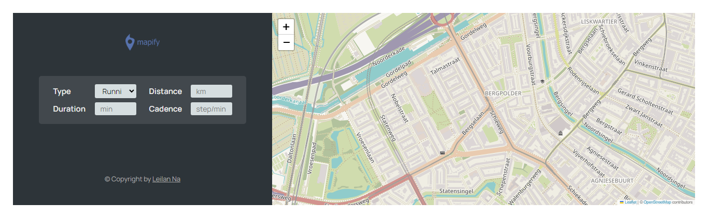

# 🗺️ Mapify


Track your workouts on an interactive map.

Mapty is a web application that allows users to log and visualize their running and cycling workouts directly on a map. The app uses geolocation and interactive maps to provide a simple and intuitive way to track outdoor activities.

## ✨ Features

- 📍 Detect your current location using Geolocation API
- 🏃 Log running workouts
- 🚴 Log cycling workouts
- 🗺️ Display workouts on an interactive map
- 📝 Store workout details:
  - Distance
  - Duration
  - Pace
  - Speed
  - Cadence
  - Elevation Gain

- 💾 Persist data using Local Storage
- 🎯 Click a workout to move the map to its location
- 📱 Responsive and user-friendly interface

## 🛠️ Built With

- HTML5
- CSS3
- JavaScript (ES6+)
- OOP (Object-Oriented Programming)
- Local Storage API
- Geolocation API
- Leaflet.js

## 📸 Screenshots

Add screenshots of your application here.

```bash
screenshots/
├── map-view.png
├── workout-form.png
└── mobile-view.png
```

## 🚀 Getting Started

### Clone the repository

```bash
git clone https://github.com/yourusername/mapify.git
```

### Navigate to the project directory

```bash
cd mapty
```

### Run locally

Since this project uses browser APIs, it's recommended to run it using a local server.

Using VS Code Live Server:

```bash
Right Click → Open with Live Server
```

Or using npm:

```bash
npx serve
```

## 📂 Project Structure

```bash
mapty/
│
├── index.html
├── style.css
├── script.js
├── icons.svg
└── README.md
```

## 🧠 Concepts Practiced

This project demonstrates:

- Classes and Inheritance
- Encapsulation
- Private Fields
- Method Chaining
- DOM Manipulation
- Event Handling
- Geolocation API
- Local Storage
- Array Methods
- Clean Code Principles

## 🎯 Future Improvements

- Edit workouts
- Delete individual workouts
- Sort workouts
- Filter workouts
- Dark mode
- Export/Import workouts
- User authentication
- Backend database integration

## 📖 Learning Project

This project was originally built as part of the JavaScript course by Jonas Schmedtmann and further customized for learning modern JavaScript and OOP concepts.
